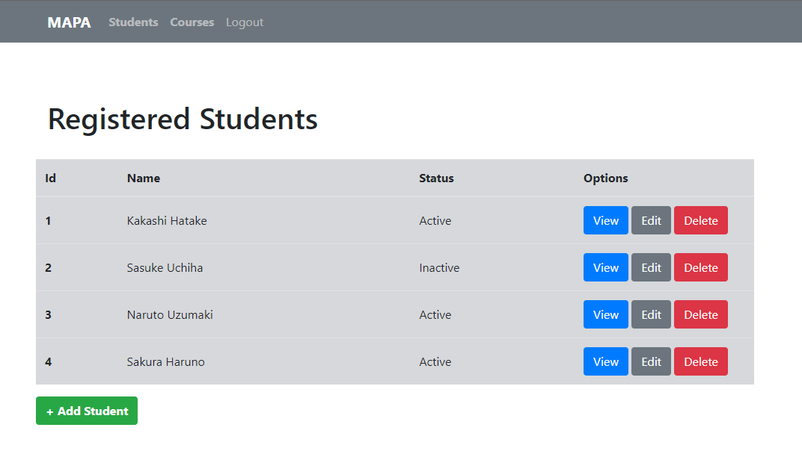

<h1 align="center">
 
    MAPA - System of Registration

</h1>

CRUD that register and handle information

  

## Features
Below are all features used on this project:

- **HTML5** — Standard markup language
- **Bootstrap** — Stylization framework
- **PHP8** — Back-End programming language
- **MySql** — DataBase

 

## Getting started

You can clone and use the repository anytime.   
If you don't remember how, follow this GitHub official link below in order to get the doc:
https://docs.github.com/pt/github/creating-cloning-and-archiving-repositories/cloning-a-repository-from-github/cloning-a-repository

You yet will come across with a login screen, where you can insert: 
    <strong>Login:</strong> 200854915
    <strong>Password:</strong> gustavo  

And you can also logoff.

 

## License

This project is licensed under the MIT License - see the [LICENSE](https://opensource.org/licenses/MIT) page for details.
